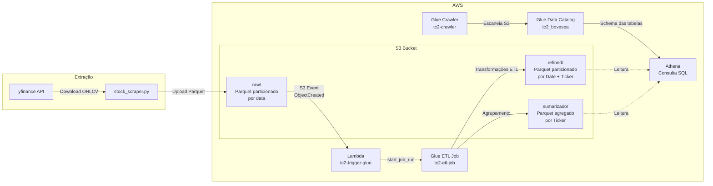
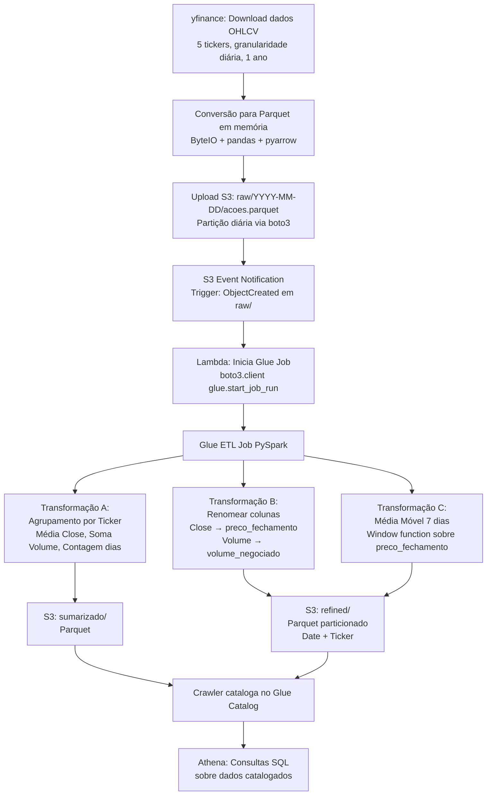

# Tech Challenge 2 -- Pipeline Batch Bovespa

## Pós-Graduação em Machine Learning Engineering -- FIAP

## Objetivo

Pipeline de dados completo para extração, processamento e análise de dados de ações da B3 (Bolsa de Valores do Brasil), utilizando serviços AWS: S3, Lambda, Glue e Athena.

O pipeline ingere dados diários de 5 ativos (PETR4, VALE3, ITSA3, BOVA11, IVVB11), aplica transformações analíticas incluindo média móvel de 7 dias, e disponibiliza os dados refinados para consulta SQL via Athena.

---

## Arquitetura



### Fluxo de Dados



---

## Estrutura do Projeto

```
Tech_challenge_2/
├── stock_scraper.py          # Extração de dados via yfinance + upload S3
├── glue_etl_job.py           # Script PySpark do Glue ETL
├── lambda_function.py        # Código da função Lambda
├── queries_athena_tc2.sql    # Queries de validação e análise
├── README.md                 # Este arquivo
├── requirements.txt          # Dependências Python
└── .gitignore                # Arquivos ignorados pelo Git
```

---

## Estrutura do S3

```
tc2-bovespa-caio-2026/
├── raw/                      # Dados brutos
│   ├── 2025-03-06/
│   │   └── acoes.parquet
│   ├── 2025-03-07/
│   │   └── acoes.parquet
│   └── ...
├── refined/                  # Dados transformados (particionado)
│   ├── Date=2025-03-06/
│   │   ├── Ticker=PETR4.SA/
│   │   ├── Ticker=VALE3.SA/
│   │   ├── Ticker=ITSA3.SA/
│   │   ├── Ticker=BOVA11.SA/
│   │   └── Ticker=IVVB11.SA/
│   └── ...
├── sumarizado/               # Dados agregados por ticker
├── scripts/                  # Scripts do Glue
│   └── glue_etl_job.py
├── temp/                     # Diretório temporário do Glue
└── athena-results/           # Resultados de queries Athena
```

---

## Serviços AWS Utilizados

| Serviço | Função | Configuração |
|---------|--------|--------------|
| **S3** | Armazenamento de dados (raw, refined, sumarizado) | Bucket: tc2-bovespa-caio-2026, região us-east-1 |
| **Lambda** | Trigger automático para iniciar Glue Job | Runtime: Python 3.12, trigger: S3 ObjectCreated em raw/ |
| **Glue ETL** | Transformações PySpark nos dados | Glue 4.0, 2 workers G.1X, PySpark 3 |
| **Glue Crawler** | Catalogação automática dos dados | Escaneia refined/ e sumarizado/ |
| **Glue Data Catalog** | Metadados das tabelas | Database: tc2_bovespa, 3 tabelas |
| **Athena** | Consultas SQL serverless | Resultados em s3://tc2-bovespa-caio-2026/athena-results/ |
| **IAM** | Controle de acesso entre serviços | Roles: lambda-tc2-role, glue-tc2-role |
| **CloudWatch** | Logs de execução | Log groups: /aws-glue/jobs/error, /aws-lambda/tc2-trigger-glue |

---

## Transformações ETL (Requisito 5)

### A) Agrupamento Numérico
Agregação por Ticker com três métricas:
- **avg_close:** Média do preço de fechamento no período
- **total_volume:** Soma do volume de negociações
- **dias_negociados:** Contagem de dias com negociação

### B) Renomeação de Colunas
- `Close` → `preco_fechamento`
- `Volume` → `volume_negociado`

### C) Cálculo Baseado em Data -- Média Móvel de 7 Dias
Média móvel calculada via Window Function do PySpark:
- Particionada por Ticker (cada ação calculada independentemente)
- Ordenada por Date
- Janela de 7 dias: linha atual + 6 anteriores (`rowsBetween(-6, 0)`)

A média móvel suaviza a volatilidade diária e evidencia tendências. Quando o preço cruza a média de cima para baixo, indica possível reversão de tendência de alta para baixa (e vice-versa).

---

## Dados Extraídos

| Ticker | Tipo | Descrição |
|--------|------|-----------|
| PETR4.SA | Ação | Petrobras PN |
| VALE3.SA | Ação | Vale ON |
| ITSA3.SA | Ação | Itaúsa ON |
| BOVA11.SA | ETF | Replica o índice Ibovespa |
| IVVB11.SA | ETF | Replica o índice S&P 500 |

**Período:** 1 ano de dados históricos (granularidade diária)  
**Colunas originais:** Date, Ticker, Open, High, Low, Close, Volume (OHLCV)

---

## Requisitos Atendidos

| # | Requisito | Status | Implementação |
|---|-----------|--------|---------------|
| R1 | Extração de dados da B3 (diário) | OK | yfinance com 5 tickers, período 1 ano |
| R2 | Dados brutos no S3 em Parquet, partição diária | OK | raw/YYYY-MM-DD/acoes.parquet |
| R3 | Bucket aciona Lambda que chama Glue | OK | S3 Event → Lambda → Glue |
| R4 | Lambda inicia job Glue | OK | Python 3.12, boto3 start_job_run |
| R5A | Agrupamento numérico | OK | groupBy Ticker: avg, sum, count |
| R5B | Renomear duas colunas | OK | Close → preco_fechamento, Volume → volume_negociado |
| R5C | Cálculo baseado em data | OK | Média móvel 7 dias (Window function) |
| R6 | Refined em Parquet, particionado por data + ticker | OK | refined/Date=.../Ticker=.../ |
| R7 | Catalogação automática no Glue Catalog | OK | Crawler → database tc2_bovespa |
| R8 | Dados consultáveis via SQL no Athena | OK | Queries validadas em 3 tabelas |

---

## Como Executar

### Pré-requisitos
- Conta AWS configurada (região us-east-1)
- Python 3.10+ com ambiente virtual
- AWS CLI configurada com access key

### Setup do Ambiente
```bash
python3 -m venv .venv
source .venv/bin/activate
pip install yfinance pandas pyarrow boto3 awscli
aws configure
```

### Executar o Pipeline
```bash
# 1. Extrair dados e enviar para S3
python3 stock_scraper.py

# 2. Lambda dispara automaticamente via S3 Event
# 3. Glue Job executa transformações automaticamente
# 4. Consultar resultados no Athena (Console AWS)
```

### Verificar Resultados
```bash
# Dados brutos
aws s3 ls s3://tc2-bovespa-caio-2026/raw/ --recursive | head -5

# Dados refinados
aws s3 ls s3://tc2-bovespa-caio-2026/refined/ | head -10

# Dados sumarizados
aws s3 ls s3://tc2-bovespa-caio-2026/sumarizado/
```

---

## Dependências

```
yfinance>=1.2.0
pandas>=3.0.0
pyarrow>=23.0.0
boto3>=1.42.0
awscli>=1.44.0
```

---

## Decisões Técnicas

| Decisão | Justificativa |
|---------|---------------|
| yfinance em vez de web scraping | API mais confiável e limpa para dados financeiros; scraping já demonstrado no TC1 |
| Parquet em vez de CSV | Armazenamento colunar: leitura seletiva, melhor compressão, otimizado para Athena |
| PySpark (código) em vez de Glue Visual | Maior controle sobre transformações, Window functions não suportadas no visual |
| Crawler para catalogação | Mais confiável que saveAsTable para registrar tabelas no Glue Catalog |
| Média móvel como cálculo de data | Indicador técnico amplamente utilizado; demonstra valor analítico real |
| DynamicFrame para escrita | Compatibilidade nativa com Glue, evita NullPointerException do saveAsTable |
| Date como string no Parquet | Evita incompatibilidade de Timestamp entre pandas/pyarrow e Spark |

## Deploy

- Vídeo apresentação disponível em: 

## Autores

**Adriano Cabrera**

- LinkedIn: https://www.linkedin.com/in/adriano-cabrera-b7b680a7/
- GitHub: https://github.com/cabrpin

**Caio Grazzini**

- LinkedIn: https://www.linkedin.com/in/caiograzzini/
- GitHub: https://github.com/Grazzica/

**Fabrício Batista Dias**

- LinkedIn: https://www.linkedin.com/in/fabriciobdias/
- GitHub: https://github.com/DiasFabricio

---

Desenvolvido como parte do Tech Challenge — Pós-Graduação em Machine Learning Engineering — FIAP 2024/2025
```